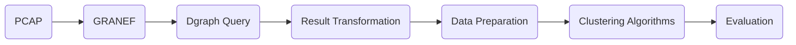

# Graph-based Anomaly Detection in Network Traffic

Public git repository for source codes for the diploma thesis "Graph-based Anomaly Detection in Network Traffic" at the Faculty of Informatics at Masaryk University.

**Main Goal:**





## Content Description

```
data/
  cicids2017/             # Dgraph query results for each attack (zipped CSV files) from CIC-IDS2017
  cyberczech/             # Dgraph query results (zipped CSV files) from Cyber Czech
impl/
  labels_generation/      # helper script for extracting Snort labels for Cyber Czech
  dgraph_query_handler/   # helper script for querying graph db (saves JSON output to a separate file)
  jupyter_notebooks/      # source codes (main implementation)
```

## Built With

* [Jupyter Notebook](https://jupyter-notebook.readthedocs.io/en/stable/)
* [PyTorch](https://pytorch.org/docs/stable/index.html)

## Usage

### Prerequisites

* Python 3
* Python libraries specified in requirements.txt
* Running Dgraph instance (described in README in impl/graph_db/data_handler/ directory)

### How to Run

*(Prerequisite: a running instance of Dgraph with loaded data.)*

1. Get all IP addresses from dataset (script is in `impl/graph_db/query_handler/`) and save them to file `host_ips.csv`:

```python
python3 query_handler.py -im -ou host_ips
```

2. Get all connection of hosts from input file and save them to files `output-<IP>.csv` (one for each host, JSON already flattened to csv):

```python
python3 query_handler.py -cm --ips_csv host_ips.csv
```

3. Create `originated` and `responded` directories and move generated CSV files to them (`output-o-*` files to `originated` directory).
4. Preprocess all output files from previous step and compute a neighborhood for each connection (`impl/jupyter_notebooks/<..>/query_output_preprocessing.ipynb`).
5. Explore the data generated in previous step (`impl/jupyter_notebooks/<..>/data_exploration.ipynb`).
6. Data cleaning and preparation (`impl/jupyter_notebooks/<..>/data_preparation.ipynb`).
7. Apply unsupervised machine learning - clustering (`impl/jupyter_notebooks/<..>/model_kmeans.ipynb`, `impl/jupyter_notebooks/<..>/model_kprototypes.ipynb`, `impl/jupyter_notebooks/<..>/model_dbscan.ipynb`)

Some paths in Jupyter notebooks assume a specific directories definition. If the directories with such names are present, the Jupyter notebooks can be easily run, and if not, they need to be changed to find the input. 

## Authors

* **Denisa Sramkova** - *Initial work* - [roa7n](https://github.com/roa7n)
